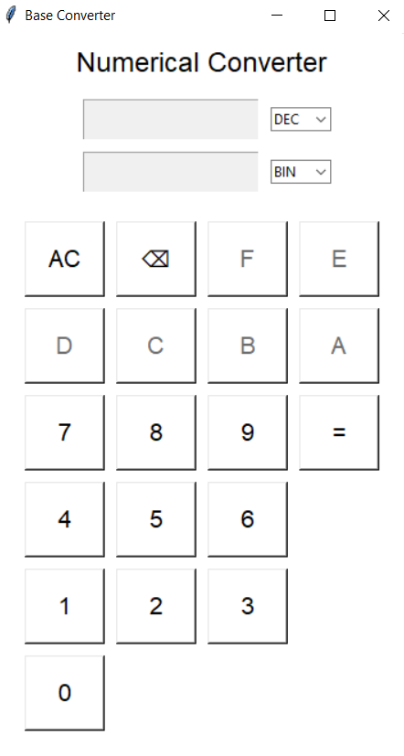

# Numerical Converter

## Overview: 

## Team Members

- عمار احمد محمود محمد
- محمد عبد الناصر جنيدى عبد التواب عبد الجيد
- محمد عزوز موسى عزوز عبد الهادي
- يوسف زاكى دسوقى زاكى دسوقى
- محمد طاهر نجيب الجريسى
- رشدى محمود رشدى محمود سيد احمد
- احمد وحيد بدوى عبد الحميد مصطفى
- عبد الرحمن محمد احمد ياقوت على
- احمد عبد الواحد عارف إسماعيل
- طارق محمد عرفه عبد الفتاح الصيفى
- اياد ياسر امام حسين عبد الكريم
- احمد عبد الفتاح محمد محمود خلف
- احمد محمد بدر فرني
- حازم جمال عزت محمد احمد
- احمد محمد رجب إبراهيم
- يوسف سامي سعد

## 1) ملف `converter_engine.py`

### **Conversion Engine – المنطق الأساسي للتحويل**

```python
# converter_engine.py

# قاموس بيحدد قيمة الأساس لكل نوع عدد
types = {'BIN': 2, 'OCT': 8, 'DEC': 10, 'HEX': 16}

# قيم الحروف الخاصة بالأعداد الست عشرية
hex_nums = {'A': 10, 'B': 11, 'C': 12, 'D': 13, 'E': 14, 'F': 15}


def any_to_dec(num, num_type):
    """
    تحويل رقم من أي نظام (BIN/OCT/DEC/HEX) إلى عشري (int)
    """
    result = 0
    base = types.get(num_type.upper(), 0)

    # نمشي على الرقم من اليمين للشمال
    for place, digit in enumerate(reversed(num)):
        # لو رقم
        if digit.isdigit():
            digit = int(digit)
        else:
            # لو حرف (A-F)
            digit = hex_nums.get(digit.upper(), 0)

        result += digit * (base ** place)

    return result


def dec_to_any(num, convert_type):
    """
    تحويل رقم عشري (string أو int) إلى نظام آخر (BIN/OCT/HEX/DEC)
    """
    base = types.get(convert_type.upper(), 0)
    num = int(num)

    if num == 0:
        return "0"

    result = ''

    while num > 0:
        remainder = num % base

        # لو الباقي من 10 لفوق نحوله لحرف (A-F)
        if remainder >= 10:
            for letter, value in hex_nums.items():
                if value == remainder:
                    remainder = letter
                    break

        result += str(remainder)
        num //= base

    return result[::-1]
```

---

## 2) ملف `controller.py`

### **Controller – منسّق المنطق بين الأنظمة**

- محمد عبد الناصر جنيدى عبد التواب عبد الجيد
- محمد عزوز موسى عزوز عبد الهادي
- يوسف زاكى دسوقى زاكى دسوقى

- محمد طاهر نجيب الجريسى
- رشدى محمود رشدى محمود سيد احمد
- احمد عبد الفتاح محمد محمود خلف

```python
# controller.py

from converter_engine import any_to_dec, dec_to_any


def convert_value(num_str, from_type, to_type):
    """
    بياخد:
        num_str  : الرقم كـ string
        from_type: نوع النظام الأصلي (BIN/OCT/DEC/HEX)
        to_type  : نوع النظام الهدف

    ويرجع:
        string: القيمة المحولة
    """
    # لو فاضي يرجع فاضي
    if not num_str:
        return ""

    # لو نفس النوع
    if from_type == to_type:
        return num_str

    # من عشري إلى أي نظام
    if from_type == "DEC":
        return dec_to_any(num_str, to_type)

    # من أي نظام إلى عشري
    if to_type == "DEC":
        dec_value = any_to_dec(num_str, from_type)
        return str(dec_value)

    # من نظام لنظام (عن طريق العشري)
    dec_value = any_to_dec(num_str, from_type)
    return dec_to_any(dec_value, to_type)
```

---

## 3) ملف `gui_io.py`

### **Input/Output GUI – واجهة الإدخال والإخراج**

- عمار احمد محمود محمد
- عبد الرحمن محمد احمد ياقوت على
- اياد ياسر امام حسين عبد الكريم

```python
# gui_io.py

import tkinter as tk
from tkinter import ttk
from converter_engine import types


def create_main_window():
    """
    إنشاء نافذة البرنامج + عناصر الإدخال والإخراج
    يرجع:
        root, input_var, output_var, from_var, to_var, from_box, to_box
    """
    root = tk.Tk()
    root.title("Base Converter")
    root.geometry("350x620")
    root.config(bg="white")

    # متغيرات الإدخال والإخراج وأنواع الأنظمة
    input_var = tk.StringVar()
    output_var = tk.StringVar()
    from_var = tk.StringVar(value="DEC")
    to_var = tk.StringVar(value="BIN")

    # عنوان التطبيق
    tk.Label(
        root,
        text="Numerical Converter",
        font=("Arial", 18),
        bg="white"
    ).pack(pady=10)

    # ----- جزء الإدخال -----
    input_frame = tk.Frame(root, bg="white")
    input_frame.pack(pady=5)

    input_entry = tk.Entry(
        input_frame,
        textvariable=input_var,
        font=("Arial", 20),
        width=10,
        justify="center",
        state="readonly"   # يقرأ فقط – المستخدم يكتب من الأزرار
    )
    input_entry.grid(row=0, column=0, padx=10)

    # قائمة اختيار نوع الرقم الداخل
    from_box = ttk.Combobox(
        input_frame,
        textvariable=from_var,
        values=list(types.keys()),
        width=5,
        state="readonly"
    )
    from_box.grid(row=0, column=1)

    # ----- جزء الإخراج -----
    output_frame = tk.Frame(root, bg="white")
    output_frame.pack(pady=5)

    output_entry = tk.Entry(
        output_frame,
        textvariable=output_var,
        font=("Arial", 20),
        width=10,
        justify="center",
        state="readonly"
    )
    output_entry.grid(row=0, column=0, padx=10)

    # قائمة اختيار النوع المحول إليه
    to_box = ttk.Combobox(
        output_frame,
        textvariable=to_var,
        values=list(types.keys()),
        width=5,
        state="readonly"
    )
    to_box.grid(row=0, column=1)

    return root, input_var, output_var, from_var, to_var, from_box, to_box
```

> ملاحظة: منع الكتابة اليدوية يتم عن طريق `state="readonly"`+ الأزرار فقط.

---

## 4) ملف `keypad_manager.py`

### **Smart Keypad Manager – التحكم الذكي في الأزرار**

```python
# keypad_manager.py

from converter_engine import types


def update_buttons(buttons_refs, from_type):
    """
    تفعيل/تعطيل أزرار الأرقام/الحروف حسب نوع النظام المختار
    buttons_refs: قاموس {label: Button}
    from_type   : "BIN" / "OCT" / "DEC" / "HEX"
    """
    base = types[from_type]

    for label, btn in buttons_refs.items():
        # HEX: كل الأزرار شغالة
        if base == 16:
            btn.config(state="normal")

        # DEC: 0-9 فقط
        elif base == 10:
            if label.isdigit() and int(label) < 10:
                btn.config(state="normal")
            else:
                btn.config(state="disabled")

        # OCT: 0-7 فقط
        elif base == 8:
            if label.isdigit() and int(label) < 8:
                btn.config(state="normal")
            else:
                btn.config(state="disabled")

        # BIN: 0 و 1 فقط
        elif base == 2:
            if label in ["0", "1"]:
                btn.config(state="normal")
            else:
                btn.config(state="disabled")
```

---

## 5) ملف `keypad.py`

### **Keypad Module – لوحة الأزرار الأساسية**

```python
# keypad.py

import tkinter as tk


def create_keypad(root, input_var, output_var, from_var, on_equal):
    """
    إنشاء لوحة الأزرار
    root      : نافذة البرنامج الرئيسية
    input_var : StringVar الخاص بالإدخال
    output_var: StringVar الخاص بالإخراج (يستخدم في AC)
    from_var  : نوع النظام الحالي (للاستخدام لو حبيت تضيف حاجات بعدين)
    on_equal  : دالة تُستدعى عند الضغط على زر =
    يرجع:
        keypad_frame, buttons_refs
    """

    keypad_frame = tk.Frame(root, bg="white")
    keypad_frame.pack(pady=15)

    buttons_refs = {}  # لحفظ أزرار الأرقام والحروف

    def press_key(val):
        # إضافة رقم/حرف إلى حقل الإدخال
        input_var.set(input_var.get() + val)

    def backspace():
        # حذف آخر رمز
        input_var.set(input_var.get()[:-1])

    def clear():
        # مسح الإدخال والإخراج
        input_var.set("")
        output_var.set("")

    # تخطيط الأزرار
    buttons_layout = [
        ["AC", "⌫", "F", "E"],
        ["D", "C", "B", "A"],
        ["7", "8", "9", "="],
        ["4", "5", "6", ""],
        ["1", "2", "3", ""],
        ["0"]
    ]

    for r, row_vals in enumerate(buttons_layout):
        for c, val in enumerate(row_vals):
            if val == "":
                continue

            # تحديد الأمر لكل زر
            if val == "AC":
                cmd = clear
            elif val == "⌫":
                cmd = backspace
            elif val == "=":
                cmd = on_equal
            else:
                cmd = lambda v=val: press_key(v)

            btn = tk.Button(
                keypad_frame,
                text=val,
                font=("Arial", 16),
                width=5,
                height=2,
                command=cmd,
                bg="white"
            )
            btn.grid(row=r, column=c, padx=5, pady=5)

            # تخزين أزرار الإدخال (الأرقام والحروف فقط)
            if val not in ["AC", "⌫", "="]:
                buttons_refs[val] = btn

    return keypad_frame, buttons_refs
```

---

## 6) ملف `main.py`

### **Main – ربط كل الـ Modules مع بعض**

```python
# main.py

import tkinter as tk

from controller import convert_value
from gui_io import create_main_window
from keypad import create_keypad
import keypad_manager


def main():
    # إنشاء النافذة وكل عناصر الـ I/O
    root, input_var, output_var, from_var, to_var, from_box, to_box = create_main_window()

    # دالة تتنفذ لما المستخدم يضغط على =
    def on_equal():
        num = input_var.get()
        from_type = from_var.get()
        to_type = to_var.get()

        result = convert_value(num, from_type, to_type)
        output_var.set(result)

    # إنشاء لوحة الأزرار
    keypad_frame, buttons_refs = create_keypad(
        root=root,
        input_var=input_var,
        output_var=output_var,
        from_var=from_var,
        on_equal=on_equal
    )

    # ربط تغيير نوع النظام بتحديث الأزرار
    def on_from_changed(event=None):
        keypad_manager.update_buttons(buttons_refs, from_var.get())

    from_box.bind("<<ComboboxSelected>>", on_from_changed)

    # أول مرة عند فتح البرنامج
    keypad_manager.update_buttons(buttons_refs, from_var.get())

    # تشغيل البرنامج
    root.mainloop()


if __name__ == "__main__":
    main()
```
